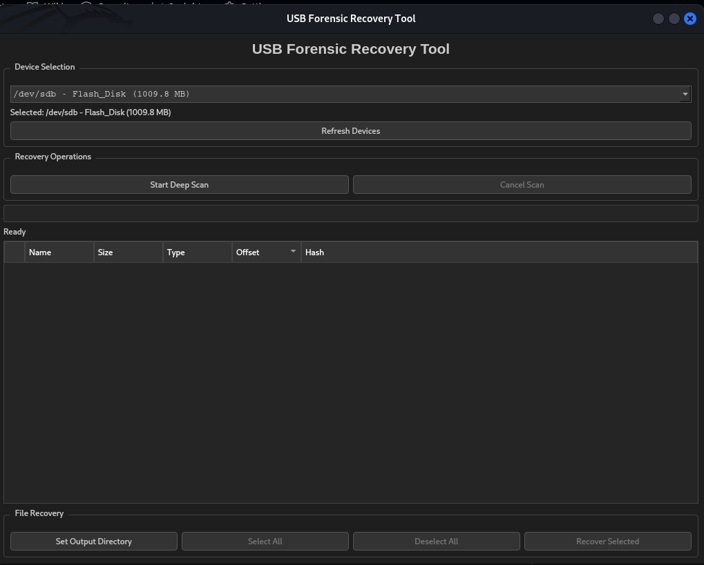
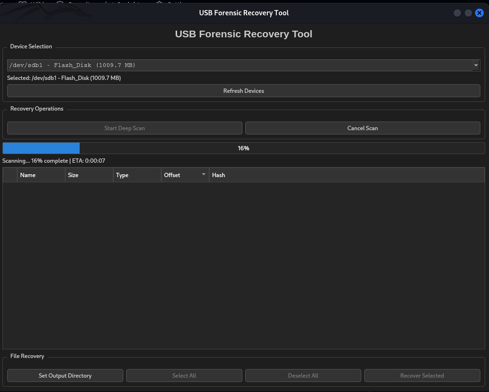
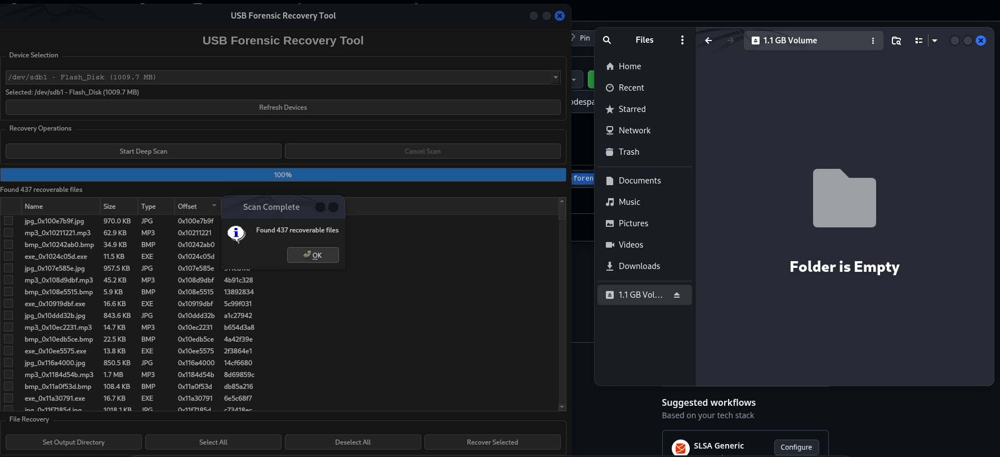
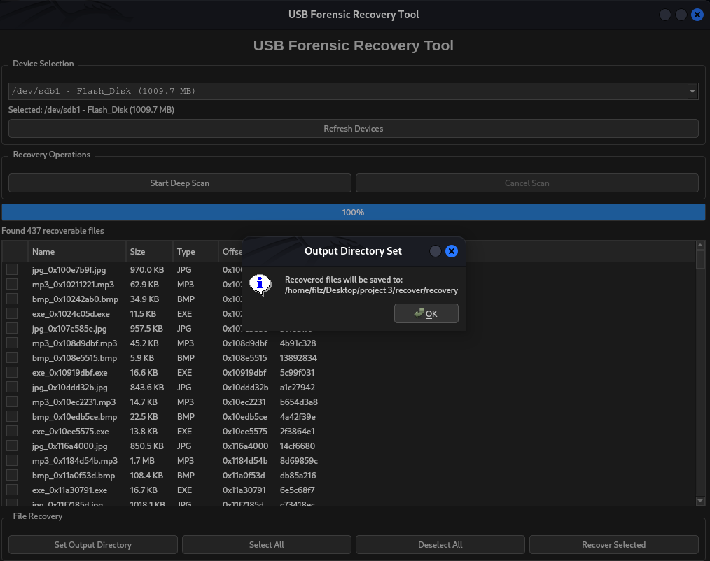
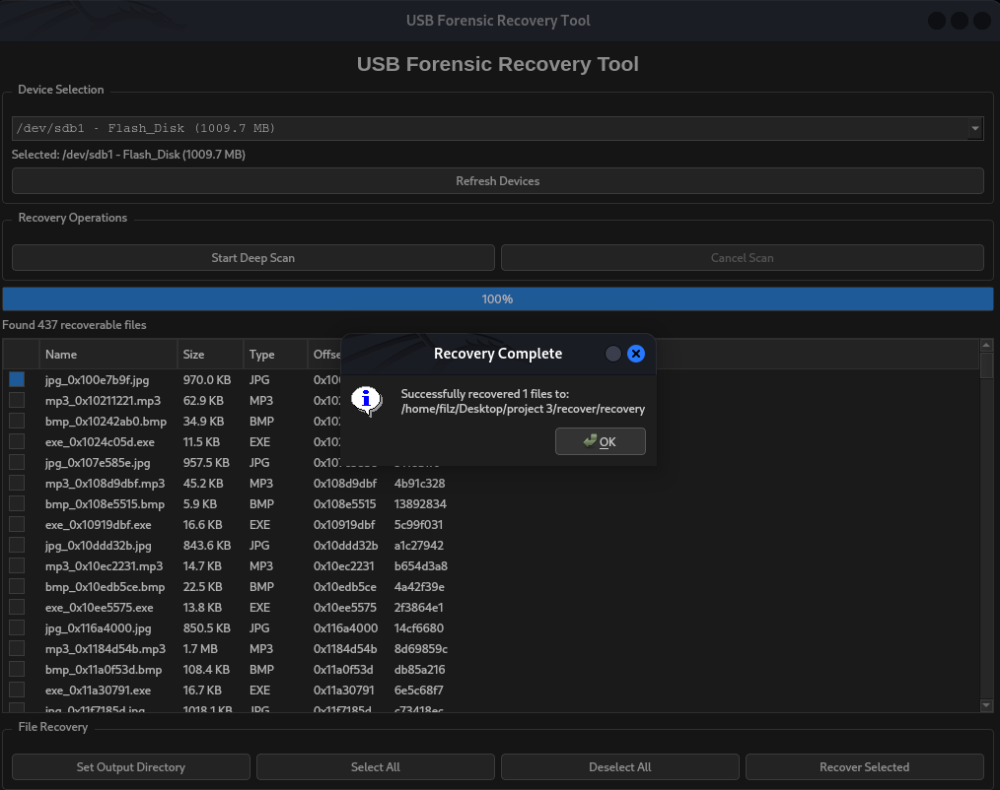

# 🔍 USB Forensic Recovery Tool

A sleek, Linux-only USB file recovery and forensic analysis tool using **PYTHON**. This tool performs deep scans on USB devices to recover lost or deleted files using **file carving techniques** based on file signatures.

> Designed for ethical forensic recovery of formatted USB drives.

---

## 🚀 Features

- 🔍 Deep file carving scan (even from formatted USBs)
- 🧠 Detects known file types by magic headers/footers
- ✅ Selective recovery with checkboxes
- 🖥️ Modern PyQt5 GUI with dark mode
- 📦 Export recovered files to a selected directory
- 💾 Automatic hash for duplicate tracking

---

## 📦 Installation (Linux Only)

> Tested on Ubuntu. Requires `python3` and `pip`.

---

### 🔧 Prerequisites

- Python 3.6+
- Linux (Ubuntu, Debian, Fedora, etc.)
- `sudo` access (to read raw devices)
- Git

---

### 🐍 Step-by-Step Setup with `myenv`

#### 1. Clone the repository

git clone https://github.com/thoufeelx/USB-forensic_Recovery.git

#### 2. Create a virtual environment

python3 -m venv myenv
source myenv/bin/activate

#### 3. Install required Python packages

pip install PyQt5 pyudev

or

pip install -r requirements.txt

#### 4. Run the tool with root privileges

sudo python usb_forensic_tool.py

##### 🧪 How It Works
Scans the raw USB device (block-by-block)

Detects and extracts files using known signatures:

JPG, PNG, PDF, MP3, MP4, ZIP, DOCX, etc.

Shows:

File name

Size

Offset

Type

Hash (MD5 short)

Allows selective recovery to a folder of your choice

#### 📁 Output Directory

By default, recovered files go to:

javascript
Copy
Edit
~/RecoveredFiles/
You can change the location via "Set Output Directory" in the GUI.

#### GUI

#### Loading

#### Found

#### Output Directory

#### Recovered

📜 License
MIT License — free to use, modify, and distribute.

## 👨‍💻 Author

**R Muhammed Thoufeel**

- 🌐 [LinkedIn](www.linkedin.com/in/r-muhammed-thoufeel-77aa48374)

- 💻 [GitHub](https://github.com/thoufeelx)

